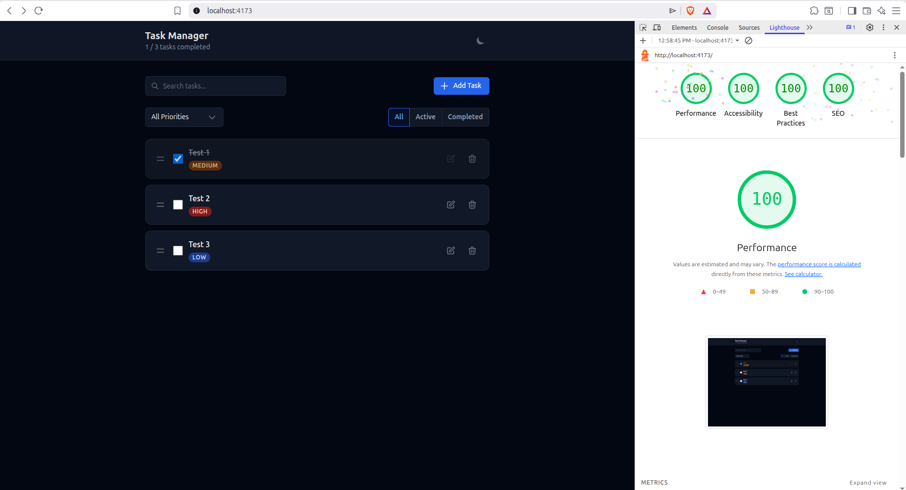

# Task Manager (Pro)

A professional, high-performance task management application built with a focus on clean architecture, accessibility, and exceptional user experience.



## 🚀 Project Overview

This application is a robust task management tool designed for scalability and speed. It leverages **React 19**, **TypeScript** (Strict Mode), and **Redux Toolkit** to provide a seamless, state-driven interface. The project adheres to a strict separation of concerns, ensuring that UI components remain pure and reusable while complex logic is handled by custom hooks and centralized state.

## 🛠️ Tech Stack

- **Core**: React 19 + Vite + TypeScript (Strict)
- **State Management**: Redux Toolkit (Single source of truth)
- **Routing & URL State**: [nuqs](https://nuqs.47ng.com/) (URL-based filtering for shareable state)
- **Drag & Drop**: `@dnd-kit` (Optimized for performance)
- **Forms**: React Hook Form + Zod (Strict schema validation)
- **Styling**: Tailwind CSS v4 (Modern design tokens, CSS variables)
- **Performance**: Debounced URL state updates, Memoized selectors
- **UX**: `sonner` (Toast notifications), Comprehensive skeleton loading (Header + List)
- **Testing**: Vitest + React Testing Library
- **Package Manager**: [Bun](https://bun.sh/)

## ✨ Core Features

- **Full CRUD Operations**: Create, edit, toggle, and delete tasks with instant feedback.
- **Priority Management**: Categorize tasks by **High**, **Medium**, and **Low** priorities.
- **Smart Filtering**: Filter tasks by completion status or priority. Filters are persisted in the URL using `nuqs`.
- **Live Search**: High-performance debounced search with URL synchronization and history protection.
- **Drag & Drop Reordering**: Reorder your entire task set with smooth, accessible animations.
- **Optimistic UI**: All operations update the UI immediately before the background process completes for a lag-free feel.
- **Persistence**: Automatic state preservation via `localStorage`.
- **Responsive Design**: Fully optimized for mobile, tablet, and desktop screens.
- **Accessibility (A11y)**: 100/100 score, featuring proper ARIA labels, semantic HTML, and logical heading hierarchies.
- **Dark/Light Mode**: Elegant theme switching with system preference detection.

## 🏛️ Architecture Highlights

- **Feature-Based Structure**: Organized by domain (`features/tasks`) to keep the codebase modular and navigable.
- **UI/Logic Decoupling**: UI components are "dumb" and focused only on rendering. All business logic is encapsulated in Redux slices or custom hooks.
- **Single Source of Truth**: Redux handles all task data, while `nuqs` synchronizes UI state with the browser URL.
- **Generic Custom Select**: Instead of native selects, we implemented a **Generic Custom Select** with logic extracted into a reusable `useCustomSelect` hook to provide:
  - Better cross-browser styling consistency.
  - Enhanced accessibility (ARIA-expanded, listbox roles).
  - Seamless integration with the design system tokens.
- **Declarative Modal System**: Native `<dialog>` implementation with a custom `useModal` hook and theme-aware backdrop blur.
- **Generic Confirmation Dialog**: A reusable modal system for destructive actions, ensuring a consistent user warning flow.

## 🎨 Styling System

The project uses a unified styling system via **Tailwind CSS v4**:

- **Design Tokens**: All colors and typography are defined as CSS variables in `src/styles/index.css`.
- **Component Classes**: Reusable classes like `.btn`, `.card`, and `.input` ensure UI consistency across the app.
- **Zero Magic Numbers**: No hardcoded color codes or spacing values in the JSX.

## 🧪 Testing

Testing is handled by **Vitest** and **React Testing Library**, with a focus on core logic:

- **Reducers**: Ensuring state transitions are predictable and correct.
- **Selectors**: Validating filtering and search logic.
- **Hooks**: Testing complex side effects and state synchronization.

Run tests:

```bash
bun run test
```

## 🏁 Getting Started

### Prerequisites

- [Bun](https://bun.sh/) installed on your machine.

### Installation

1. Clone the repository:
   ```bash
   git clone <repository-url>
   ```
2. Install dependencies:
   ```bash
   bun install
   ```

### Development

Start the development server:

```bash
bun run dev
```

### Production Build

Build and preview the optimized application:

```bash
bun run build
bun run preview
```

## 📈 Performance & Lighthouse

The application is optimized for the **Critical Rendering Path**:

- **Perfect 100s**: Achieved 100 scores across Performance, Accessibility, Best Practices, and SEO.
- **Zero Layout Shift**: Cumulative Layout Shift (CLS) is 0 thanks to stable skeletons and pre-allocated space.
- **History Protection**: Debounced URL updates ensure browser navigation (Back/Forward) remains clean and intuitive.
- **Perceived Speed**: Asynchronous initialization with skeletons provides immediate visual feedback, building user trust during data retrieval.

---

_Built with ❤️ for Fekra Assessment_
